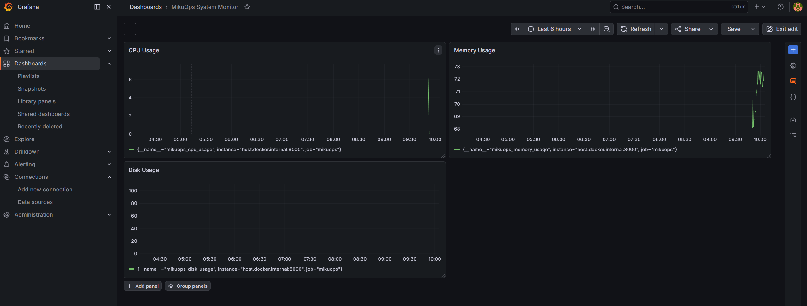
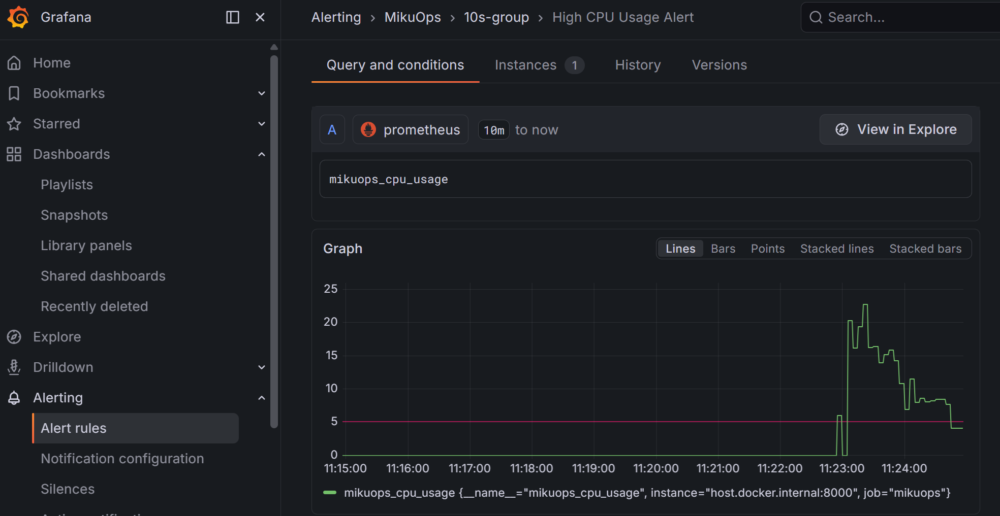

# mikuops
Next-generation cloud monitoring and DevOps platform built with FastAPI, React, Docker and Kubernetes.  

FastAPI、React、Docker、および Kubernetes で構築された、次世代のクラウドモニタリング＆ DevOps プラットフォーム。  

基于 FastAPI、React、Docker 和 Kubernetes 构建的次世代云监控与 DevOps 平台。  
  

## 機能

- システム監視
- CPU/Memory/Disk使用率監視
- Dockerコンテナ監視
- リアルタイムログ監視
- アラート通知
- サービス死活監視
- SQLite履歴保存

## 📊 モニター(Dashboard)




## 📊 監視・アラート機能 (Monitoring & Alerting)

本プロジェクトでは、本格的な本番環境を想定したインフラ監視体制（Observability）を構築しています。CPU、メモリ、ディスクの各リソースをリアルタイムに視覚化し、異常検知時には自動でアラートを発報します。

### 🏗️ 監視アーキテクチャ
* **データソース (Exporter)**: FastAPI 内で `prometheus-client` を使用し、`/api/metrics` エンドポイントからシステムメトリクスを出力。
* **データ収集 (TSDB)**: Prometheus が 5秒間隔でメトリクスを自動プル（Scrape）。
* **可視化・異常検知 (Visualization & Alerting)**: Grafana を使用してダッシュボードを作成し、アラートルールを設定。

### 📸 監視ダッシュボード & アラート発報の様子
> **💡 負荷テスト時の挙動**: 
> Windows の PowerShell または Python でCPU負荷を意図的に高めるテスト（圧殺テスト）を実施。
> CPU使用率が閾値（5%）を30秒間超え続けた際、Grafana のアラートステータスが `Normal` (緑) から `Firing` (赤) に自動で切り替わることを実証済みです。


*図：構築した Grafana 監視画面と、CPU負荷上昇時に作動するアラートシステム*

## 🚀 クイックスタート (Docker Compose)

本プラットフォームは、Docker Compose を利用してワンコマンドで全環境（フロントエンド、バックエンド、監視インフラ）を構築できます。

### 1. 前提条件
- [Docker Desktop](https://www.docker.com/products/docker-desktop/) がインストールされ、起動していること。

### 2. 起動手順
リポジトリをクローンし、ルートディレクトリで以下のコマンドを実行してください：

```bash
# 依存関係のインストール、イメージのビルド、およびコンテナの起動を自動で行います
docker compose up --build

各サービスへのアクセス
コンテナが正常に起動した後、ブラウザから以下の URL にアクセスできます：

Frontend (Dashboard): http://localhost:8080

Backend API (Swagger UI): http://localhost:8000/docs

Prometheus UI: http://localhost:9090

Grafana Dashboard: http://localhost:3000 (初期ユーザー名/パスワード: admin / admin)